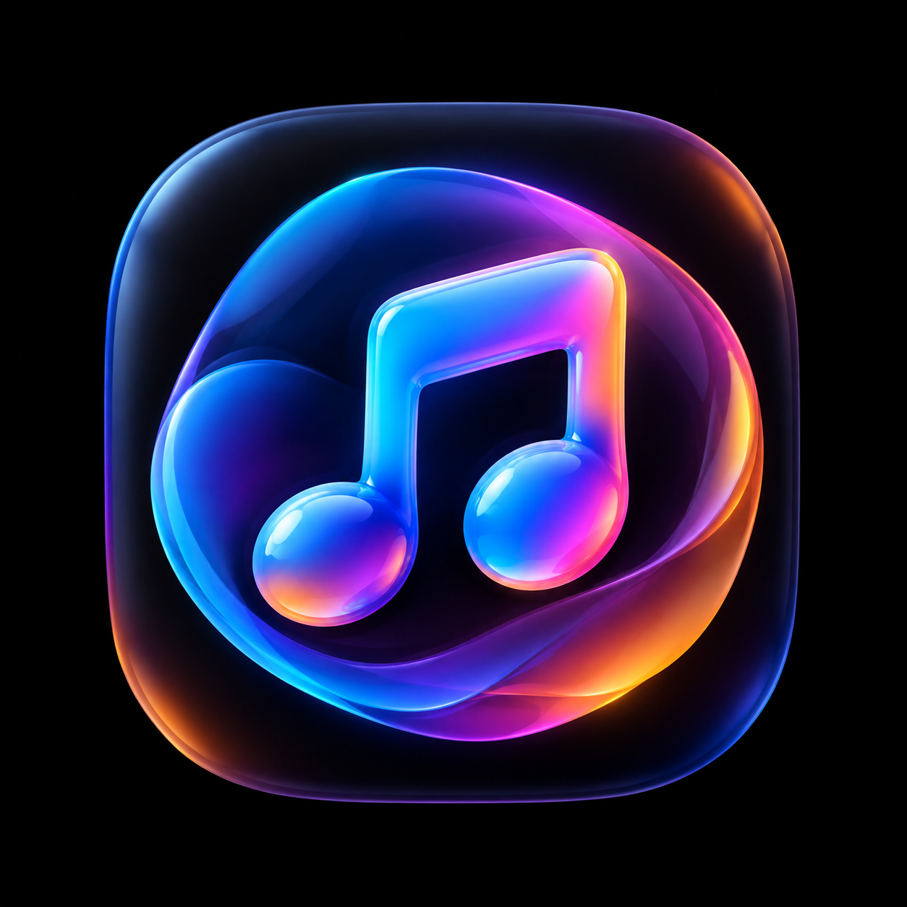

<p align="center">
  
</p>

# Audplayer

<p align="center">
  
  
  
  
  
  
  
  
</p>

A private, on-device music player for Android (and iOS/web). Your audio files live on your device — the app finds them, tags them, and plays them, with no accounts, no cloud sync, and no streaming service attached.

**Repository:** [github.com/maisamabbas0323/audplayer](https://github.com/maisamabbas0323/audplayer)

## Download

Get the latest installable **APK** for Android:

[⬇️ Download audplayer.apk](https://github.com/maisamabbas0323/audplayer/releases/latest/download/audplayer.apk)

See the [Releases page](https://github.com/maisamabbas0323/audplayer/releases) for the full changelog and all versions.

## Features

- **Auto-scan your device** for music — reads the system media library across all common audio formats (mp3, wav, m4a/aac, ogg/opus, flac, wma, aiff, mid, amr, 3gp, mka, caf, dsf…), with a proper runtime permission request (`READ_MEDIA_AUDIO` / `READ_EXTERNAL_STORAGE` on Android, media library on iOS). On first launch with an empty library it offers to scan automatically.
- **Import files or folders** — pick individual audio files, scan a whole directory (native folder picker), or select a folder on web. No duplicates: files already in the library are skipped.
- **Embedded metadata & artwork** — title, artist, album and cover art are read from the file tags; files are copied into the app's own library so they keep working later.
- **Full playback control** — queue, shuffle, repeat (off / all / one), seek with a scrubbing progress bar, favorite tracks, play next / add to queue.
- **Persistent library** — tracks, favorites, playlists and settings are stored on-device and survive restarts; the queue and playback position are restored.
- **Settings that actually do things** — volume (a progress-bar style control, same as the player), auto-play next, resume playback, remember queue, compact list, background playback (pauses when the app leaves the foreground unless enabled).
- **Relink support** — if a file moves on the device, "Verify & relink library" re-points affected tracks automatically.

## Platforms

- **Android** — primary target, installed via the APK
- **iOS** — supported (Expo Go / dev build)
- **Web** — supported via Expo web (file/folder picking included)

## Requirements

- Node.js 20+ and npm
- For building the APK: an [Expo/EAS account](https://expo.dev) (`npx eas-cli login`)

## Getting started

Clone the repo and install dependencies:

```bash
git clone https://github.com/maisamabbas0323/audplayer.git
cd audplayer
npm install
npx expo start
```

Offline or on a network that can't reach Expo's version API:

```bash
npx expo start --offline
```

### Web

```bash
npx expo start --web
```

## Building the Android APK

Builds are handled by EAS Build. The `preview` profile produces an installable **APK** (the `production` profile outputs an AAB for the Play Store).

```bash
npx eas-cli build --platform android --profile preview
```

On networks where Node's outbound HTTPS connections are flaky (IPv6 stalls), force IPv4 DNS resolution first:

```bash
export NODE_OPTIONS="--dns-result-order=ipv4first"
npx eas-cli build --platform android --profile preview
```

Once the build finishes, download the APK from the build link and place it at:

```
build/audplayer.apk
```

You can then install it on an Android device, or sideload it via a connected device / emulator.

## Permissions used

- **Media / audio read** — required to scan the device and find your songs (asked only when you scan).
- No network or storage permissions beyond what's needed for the above; playback is entirely local.

## Project structure

```
App.tsx                    App shell: tabs, dock, overlays, sheets
src/
  components/              UI: toolbars, progress bar, track rows, sheets, dialogs
  context/AppProvider.tsx  Global state: library, settings, imports, playback wiring
  hooks/useAudioPlayer.ts  Player engine (expo-audio) with queue/shuffle/repeat
  lib/
    mediaLibrary.ts        Device audio scanner (expo-media-library, paginated)
    filesystem.ts          Import/copy, metadata extraction, relink, directory scan
    storage.ts             AsyncStorage-backed persistence
    metadata.ts            ID3-tag parsing
  screens/                 Home, Library, Play, Settings
  theme.ts                 Colors, type and spacing tokens
eas.json                   Build profiles (development / preview / production)
```

## Notes

- Files imported through the app are kept on-device; removing a track from the library deletes only the app's copy, never the original file.
- Folder scanning on web uses the browser's directory picker (`webkitdirectory`).
- The Android app ID is `com.audplayer.app`.

## License

Released under the [MIT License](LICENSE).